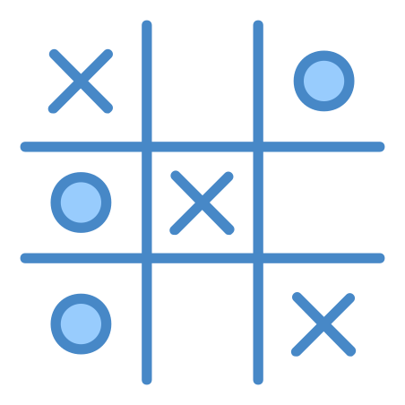

#  Tic-Tac-Toe Game Engine



## About

The objective of this project is to abstract a tic-tac-toe game engine logic into an isolated module that can be used for multiple projects.
This game was developed using TDD methodology.

## Game Rules
* A game is over when all fields in a row are taken by a player
* Players take turns taking fields until the game is over
* A game is over when all fields in a diagonal are taken by a player
* A game is over when all fields are taken
* There are two players in the game (X and O)
* A game has nine fields in a 3x3 grid
* A game is over when all fields in a column are taken by a player
* A player can take a field if not already taken
* When a player wins or if there are no more available spots, the game ends.

## Used technologies and methodologies

* **TDD**
* **Swift**
* **Unit Tests**
* **Parameterized Tests**
* **Kata**

## How to use:

### Option 1: Start new game with an empty game board
```
class GameClient: GameDelegate {

    let game = Game()
    
    init() {
        //Change player firstPlayerSymbol as you like
        let game = Game(firstPlayerSymbol: .circle, delegate: self)
    }

    func didUpdateBoard(_ board: Board) {
        //Implement logic to update UI with the new board state
    }

    func didFoundWinner(_ winner: PlayerSymbol?) {
        //Implement logic to handle new winner found
    }
}
```
### Option 2: Resume game with a board state

```
class GameClient: GameDelegate {

    let game = Game()
    
    init() {
        let currentBoardState: [PlayerSymbol?] = [  .cross,  .none, .none,
                                                    .none,   .none, .none,    
                                                    .circle, .none, .none]
                                                    
        do {
            let game = try Game(board: currentBoardState, delegate: self, nextPlayer: .cross)
        } catch let error {
            //Is recommended to handle each error case differently 
            print(error)
        }
    }

    func didUpdateBoard(_ board: Board) {
        //Implement logic to update UI with the new board state
    }

    func didFoundWinner(_ winner: PlayerSymbol?) {
        //Implement logic to handle new winner found
    }
}
```

